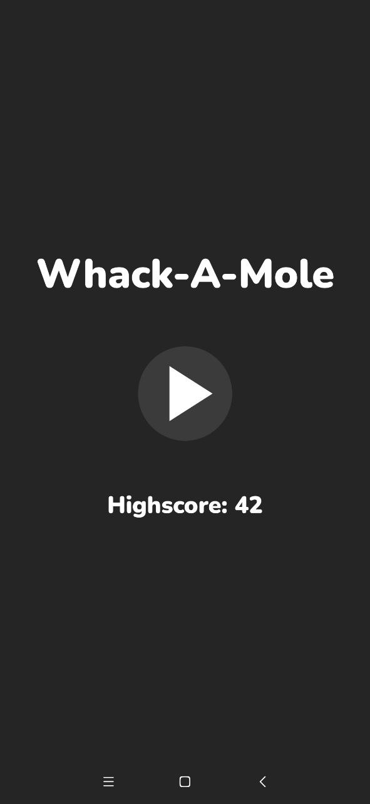
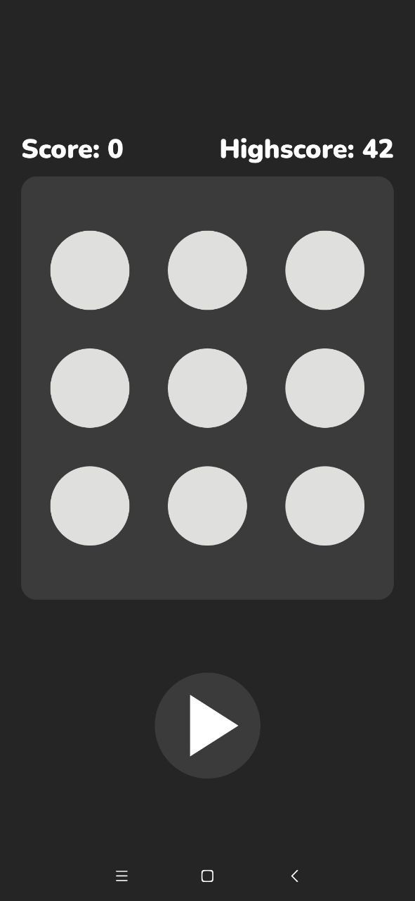
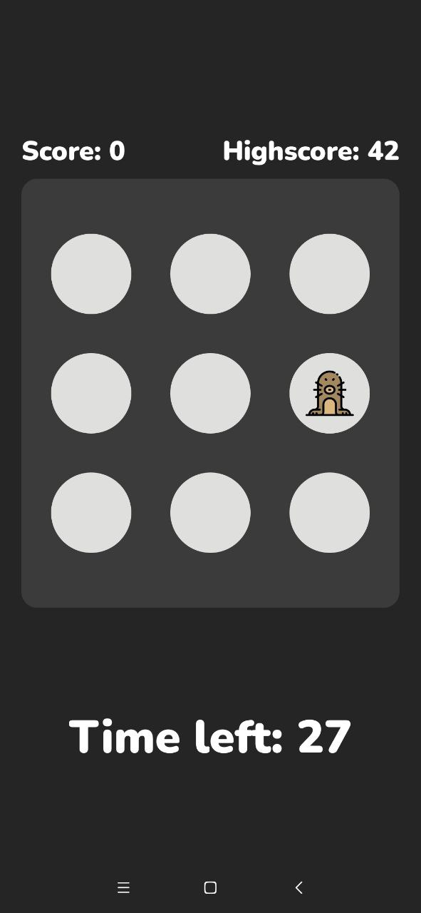

# Whack-a-mole

# Whack-a-mole

MinSDK: 21 (Android 5.0 Lollipop).

Technologies used: MVVM, View Binding, Single Activity App, Kotlin Coroutines.

Libs used: Navigation, Android Architecture Components.

  
Screenshots:

  

  

